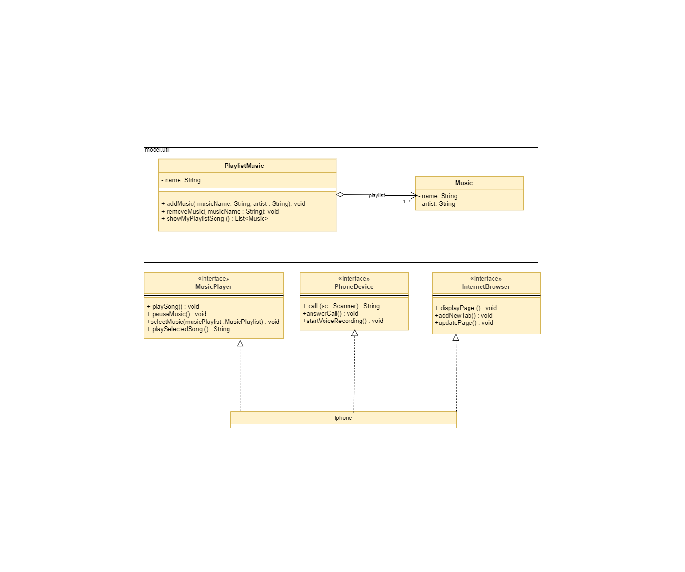

# Simulador de iPhone em Java

Bem-vindo ao repositório do meu projeto de Simulador de iPhone em Java. Este é um projeto inspirado em desafios de programação orientada a objetos da [Digital Innovation One](https://github.com/digitalinnovationone/trilha-java-basico) e visa demonstrar conceitos de programação  orientada a objetos

# Descrição

Este projeto é um simulador das funcionalidades de um dispositivo semelhante a um iPhone, implementado em Java. Ele oferece uma experiência interativa em que os usuários podem explorar funcionalidades ilustrativas por console como reprodutor de música, navegador da internet e telefone.

# Funcionalidades

- **Reprodutor de Música**: Tocar, pausar e selecionar músicas de uma playlist do Nirvana pelo nome da música.

- **Navegador da Internet**: Exibir páginas, adicionar novas abas e atualizar o conteúdo de páginas web simuladas.

- **Telefone**: Fazer chamadas telefônicas simuladas, responder a chamadas recebidas e iniciar correio de voz.

## Proposta
Projeto foi construído conforme diagrama a seguir: 

# Contribuição

Contribuições são bem-vindas! Se você quiser melhorar este projeto ou reportar problemas, sinta-se à vontade para abrir problemas ou enviar solicitações de pull.

**Aproveite o simulador e divirta-se explorando as ilustrações de funcionalidades de um "iPhone" em Java!** 📱

## Contato

- 

- 

